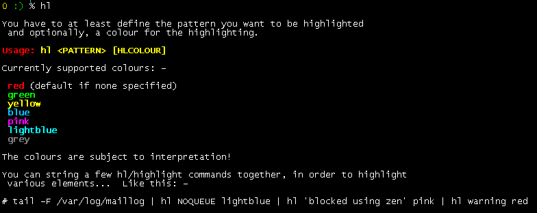
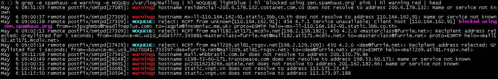

# hl
hl - highlights anything that matches your REGEX, in the COLOUR desired - cuz sometimes 'grep' isn't enough

## Authors

* **Chris Phillips** - *Initial work* - [furriephillips](https://github.com/furriephillips)

See also the list of [contributors](https://github.com/furriephillips/hl/contributors) who participated in this project.

## License

This project is licensed under The Artistic License 2.0 - see the [LICENSE](LICENSE) file for details

## Help Usage

## Real example, highlighting spammers in a maillog

